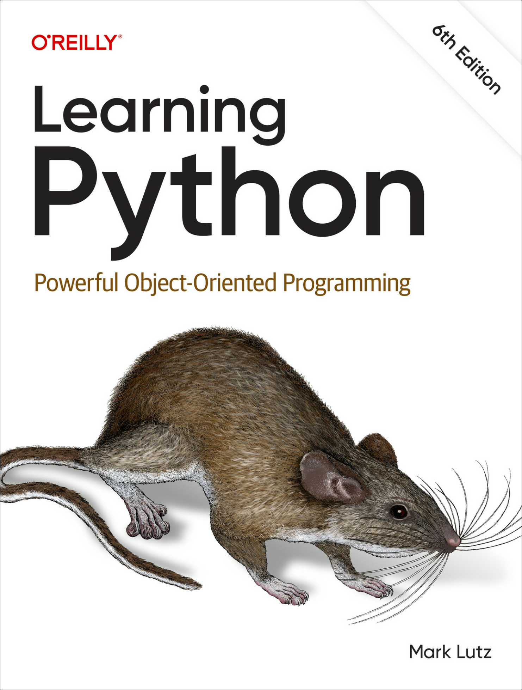

# Notes from "Learning Python" by Mark Lutz



<details>
<summary>Book Resources</summary>

- [Book Code](https://learning-python.com/LP6E-code)
- [Python Documentation](https://docs.python.org/3/)

</details>

## Part II. Objects and Operations

### 4. Introducing Python Objects

**The Python Conceptual Hierarchy**:  
1. Programs are composed of modules.
2. Modules contain statements.
3. Statements contain expressions.
4. Expressions create and process objects.

**Python's Core Object Types**:  

| Object type            | Example literals/creation                                         |
| ---------------------- | ----------------------------------------------------------------- |
| Numbers                | `1234`, `3.1415`, `0b111`, `1_234`, `3+4j`, `Decimal`, `Fraction` |
| Strings                | `'code'`, `"app's"`, `b'a\x01c'`, `'h\u00c4ck'`, `'Häck🐍'`        |
| Lists                  | `[1, [2, 'three'], 4.5]`, `list(range(10))`                       |
| Dictionaries           | `{'job': 'dev', 'years': 40}`, `dict(hours=10)`                   |
| Tuples                 | `(1, 'app', 4, 'U')`, `tuple('hack')`, `namedtuple`               |
| Files                  | `open('docs.txt')`, `open(r'C:\data.bin', 'wb')`                  |
| Sets                   | `set('abc')`, `{'a', 'b', 'c'}`                                   |
| Other core objects     | `Booleans`, `types`, `None`                                       |
| Program-unit objects   | `Functions`, `modules`, `classes`                                 |
| Implementation objects | `Compiled code`, `stack tracebacks`                               |

#### Strings

##### Sequence Operations

Python allows referencing index positions in strings using square brackets `[]`:  
```python
>>> S = 'Code'
>>> len(S)
4
>>> S[0]
'C'
>>> S[1]
'o'
>>> 
```
You can also index backwards using negative numbers:
```python
>>> S[-1]
'e'
>>> S[-2]
'd'
```
More formally, a negative index is added to the length of the string to yield a positive offset:
```python
>>> S[-1]
'e'
>>> S[len(S)-1]
'e'
Slicing allows you to extract a section, providing everything from the start index up to but not including the end index:
```python
>>> S
'Code'
>>> S[1:3]        # Slicing from index 1 to 2 (3 is excluded)
'od'
```
- The left bound defaults to 0 and the right bound defaults to the length of the sequence being sliced:
```python
>>> S
'Code'
>>> S[1:]          # Slicing from index 1 to the end of the string
'ode'
>>> S[0:3]         # Slicing from index 0 to 2 (3 is excluded)
'Cod'
>>> S[:3]          # Slicing from index 0 to 2 (3 is excluded)
'Cod'
>>> S[:-1]         # Slicing from index 0 to -1 (last character excluded)
'Cod'
>>> S[:]           # Slicing from index 0 to the end of the string
'Code'
```
Strings also support concatenation and repetition: 
```python
>>> S
'Code'
>>> S + 'xyz'        # S remains unchanged
'Codexyz'
>>> S
'Code'
>>> S * 8
'CodeCodeCodeCodeCodeCodeCodeCode'
```

##### Immutability

Strings are immutable, meaning they cannot be changed in place: 
```python
>>> S
'Code'
>>> S[0] = 'z'
Traceback (most recent call last):
  File "<python-input-34>", line 1, in <module>
    S[0] = 'z'
    ~^^^
TypeError: 'str' object does not support item assignment
```
You can, however, run expressions to make new objects:
```python
>>> S = 'Z' + S[1:]
>>> S
'Zode'
```
The following core object types are immutable:  
- Strings
- Numbers
- Tuples

You can change text-based data in place if you use a mutable object type, such as a list.
```python
>>> S = 'Python'
>>> L = list(S)
>>> L
['P', 'y', 't', 'h', 'o', 'n']
>>> L[0] = 'C'
>>> ''.join(L)
'Cython'
```
The following example shows you can use a `bytearray`  to support in-place changes: 
```python
>>> B = bytearray(b'app')
>>> B.extend(b'lication')
>>> B
bytearray(b'application')
>>> B.decode()
'application'
```
> A `bytearray` is a mutable sequence of bytes--essentially, it's like a list of bytes that you can modify.

#### Type-Specific Methods

The `find()` and `replace()` methods are used to search and replace substrings in strings: 
```py
>>> S = 'Code'
>>> S.find('od')
1
>>> S
'Code'
>>> S.replace('od', 'abl')
'Cable'
>>> S
'Code'
```
Note the original string remains unchanged. 

Other methods:
```py
>>> line = 'aaa,bbb,cccc,dd'
>>> line.split(',')                   # Splits the string on a delimiter into a list of substrings
['aaa', 'bbb', 'cccc', 'dd']

>>> S = 'code'
>>> S.upper()                         # Upper- and lowercase conversions
'CODE'

>>> S.isalpha()                       # Content tests: isalpha, isdigit, etc.
True

>>> line = 'aaa,bbb,cccc,dd\n'
>>> line.rstrip()                     # Remove whitespace from the right side of the string
'aaa,bbb,cccc,dd'

>>> line = 'aaa,bbb,cccc,dd\n'
>>> line.rstrip().split(',')          # Combining two operations, left to right
['aaa', 'bbb', 'cccc', 'dd']
```

Three formatting operations are available: 
```py
>>> 'Using %s version %s.%s' % (tool, major, minor + 9)       # Format expression, known as the old-style string formatting
'Using Python version 3.12'

>>> 'Using {} version {}.{}'.format(tool, major, minor + 9)   # Format method, newer
'Using Python version 3.12'

>>> f'Using {tool} version {major}.{minor + 9}'               # f-string, the newest
'Using Python version 3.12'
```
All three methods resolve substitution values and build new strings when they are run.

Each form is rich with features and matter most when generating readable output and numeric reports:

```py
>>> '%.2f | %+05d' % (3.14159, -62)                   # Digits, signs, padding
'3.14 | -0062'

>>> '{1:,.2f} | {0}'.format('sapp'[1:], 29699.256)    # Commas, decimal digits
'29,699.26 | app'

>>> f'{296999.256:,.2f} | {'sapp'[1:]}'               # Ditto, with nested quotes
'296,999.26 | app'
```

#### Getting Help

Use the built-in `dir()` function to list the attributes of an object: 
```py
>>> S = 'Code'
>>> dir(S)
['__add__', '__class__', '__contains__', '__delattr__', '__dir__', '__doc__', '__eq__', '__format__', '__ge__', '__getattribute__', '__getitem__', '__getnewargs__', '__getstate__', '__gt__', '__hash__', '__init__', '__init_subclass__', '__iter__', '__le__', '__len__', '__lt__', '__mod__', '__mul__', '__ne__', '__new__', '__reduce__', '__reduce_ex__', '__repr__', '__rmod__', '__rmul__', '__setattr__', '__sizeof__', '__str__', '__subclasshook__', 'capitalize', 'casefold', 'center', 'count', 'encode', 'endswith', 'expandtabs', 'find', 'format', 'format_map', 'index', 'isalnum', 'isalpha', 'isascii', 'isdecimal', 'isdigit', 'isidentifier', 'islower', 'isnumeric', 'isprintable', 'isspace', 'istitle', 'isupper', 'join', 'ljust', 'lower', 'lstrip', 'maketrans', 'partition', 'removeprefix', 'removesuffix', 'replace', 'rfind', 'rindex', 'rjust', 'rpartition', 'rsplit', 'rstrip', 'split', 'splitlines', 'startswith', 'strip', 'swapcase', 'title', 'translate', 'upper', 'zfill']
```


